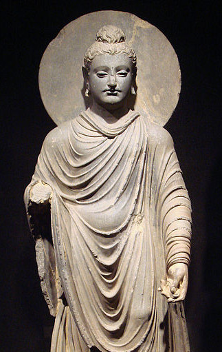

<!-- .slide: class="center" data-background-image="img/unsplash-SrlmVWkVfJM-cross.jpg" -->

# Boast of My Weakness
## II Corinthians 11:18-30
[boast-of-weakness.seanho.com](http://boast-of-weakness.seanho.com/)

<small>
([PDF 16:9](http://boast-of-weakness.seanho.com/boast-of-weakness-16_9.pdf),
[4:3](http://boast-of-weakness.seanho.com/boast-of-weakness-4_3.pdf))
</small>

>>>
29 May 2016, ECBC English and Bridge

----------------------------------------

## Threat of the Charlatans
* ch10: The Spiritual **Battleground**
* ch11a: Lost Your **First Love**
* ch11b: **Boast** of My Weakness
* ch12a: My **Grace** Is Sufficient
* ch12b: As **Parents** for Their Own Children

>>>
High-level outline of ch10-12, the last major threat to the church
addressed by Paul in 2Cor: **boastful false apostles**.

----------------------------------------
<!-- .slide: data-background-image="img/Rembrandt_Man_in_Armour.jpg" -->

## The Spiritual Battleground (2Cor10)
* "Corinth and Beyond"
* 1-6: We **fight** not according to flesh
* 7-11: Apostolic **authority** for building up
* 12-18: **Measured** by God's canon

>>>
Pastor Arthur's sermon from two weeks ago:
missions focus, armor of God

----------------------------------------
<!-- .slide: data-background-image="img/unsplash-NaWKMlp3tVs-bible.jpg" -->

## Lost Your First Love (2Cor11a)
* "What Impresses You?"
* 1-6 (You): corrupted away from **simple devotion**
* 7-11 (We): kept ourselves **unburdensome**
* 12-15 (They): **masquerading** as apostles

>>>
Pastor Phil's sermon from last week:
get away from personality cults / celebrities,
get back to a simple devotion to Christ

----------------------------------------
<!-- .slide: data-background-image="img/unsplash-8CwoHpZe3qE-hands.jpg" -->

## My Grace Is Sufficient (2Cor12)
* 1-4: Visions of **heaven**
  + 5-10: Power perfected in **weakness**
* 11-21: As **parents** for their own children

>>>
Brother Sunday next week

----------------------------------------
<!-- .slide: data-background-image="img/unsplash-SrlmVWkVfJM-cross.jpg" -->

## Boast of My Weakness (2Cor11b)

1. **Charlatans** (v18-21a)
2. **Credentials** (v21b-22)
3. **Crises** (v23-27)
4. **Concern** (v28-30)

----------------------------------------

## 2 Corinthians 11:18-21a (NIV)

Since many are **boasting** in the way the world does,  
**I too** will boast.

You gladly **put up** with fools since you are so **wise**!  

[You: Corinthians]

In fact, you even put up with anyone 

who **enslaves** you  
or **exploits** you or **takes advantage** of you  
or puts on **airs** or **slaps** you in the face.  

[They: Charlatans]

To my shame I admit that we were too **weak** for that!  

[We: Christ's servants]

----------------------------------------

## 1a. They: Charlatans (20)

* "**Enslaves**"
  + e.g., to legalism, Gal4:9
* "**Exploits**" *(eat, swallow)*
  + c.f. Mk12:40
* "**Takes advantage**" *(take)*
  + c.f. 2Cor12:16
* "**Puts on airs**" *(raise up)*
  + c.f. 2Cor10:5
* "**Slaps in face**" *(strike)*

>>>

1. to legalism, human authority
2. consume resources/money (cf widows)
3. capture in net, trick (12:16)
4. elevates self
5. deride, insult, humiliate

----------------------------------------

## 1b. You: Corinthians (19)

* "You are so **wise**!"
  + pride in own judgment
* "**Put up** with fools"
  + failure to restrain
* "**Gladly**": with pleasure, delight

>>>
1. Priding yourself on your good judgment
2. Endure, accept, fail to censure: inaction
  + Jam4:16-17, boast in arrogance; does not do the right
3. Delight in this acceptance
  + See doctrinal liberality as a virtue
  + Everyone has a voice
* (img: Buddha, 1st c. AD, Tokyo National Museum)

----------------------------------------

## 1c. We: Christ's servants (18, 21a)

* "To my **shame**": (irony!)
* "We were too **weak**": c.f. v23-28
* "Boasting [as] the **world** does":
  + According to **flesh**
* "**I too** will boast":
  + But not in the same way: he boasts about **weakness**!

,_c._1657.jpg)

>>>
1. Dishonour: Corinthians ashamed of Paul
2. Alluding to the content of his boast
3. Corinthians were **impressed** by the boasting
* Paul is not **stooping** to their level, but
  + **Deflating** their claims, in order to
  + Bring the Corinthians back to **simple devotion** to Christ

----------------------------------------

## 1. Charlatans (18-21a)

Since many are **boasting** in the way the world does,  
**I too** will boast.

You gladly **put up** with fools since you are so **wise**!  
[You: Corinthians]

In fact, you even put up with anyone 

who **enslaves** you  
or **exploits** you or **takes advantage** of you  
or puts on **airs** or **slaps** you in the face.  
[They: Charlatans]

To my shame I admit that we were too **weak** for that!  
[We: Christ's servants]

>>>
+ Review pt1:
  + They proudly **abuse** you
  + You **endure** it and even delight in your liberality
  + We will **deflate** the illusion
    + our boast is our **weakness**
+ personality cult
  + e.g., Jobs
  + e.g., mom+son following me
  + 1Cor1:12-13 Paul, Apollo, etc.
  + e.g., JMS

----------------------------------------

## Providence (JMS)

For further reading:
* [Apologetics Index](http://www.apologeticsindex.org/416-jung-myung-seok)
* [A Study of Denominations](http://www.astudyofdenominations.com/denominations/providence/)
* [JMSCult](http://jmscult.com/)

>>>
Jung Myung Seok (Joshua)
+ splinter from Unification church ("Moonies")
+ numerology arguing as Messiah
+ "always smile": life is good, hardship is only mental
+ Love Principle: Eve fell due to sex; women redeemed via sex w/JMS
  + in jail in Korea since 2009, 3 counts rape (100s of accusations)

----------------------------------------
<!-- .slide: data-background-image="img/unsplash-SrlmVWkVfJM-cross.jpg" -->

## Boast of My Weakness (2Cor11b)

1. *Charlatans* (v18-21a)
2. **Credentials** (v21b-22)
3. *Crises* (v23-27)
4. *Concern* (v28-30)

----------------------------------------

## 2 Corinthians 11:21b-22 (NIV)

Whatever anyone else **dares** to boast about --  
I am speaking as a **fool** --  
**I also** dare to boast about.

Are they **Hebrews**? So am I.  
Are they **Israelites**? So am I.  
Are they **Abraham’s descendants**? So am I. 

>>>
*dare*: bold, brash, unashamed
+ Paul knows boasting is foolishness
  + 12:1 no profit
  + 11:16 don't deem him to be a fool

----------------------------------------

## 2. Credentials

* Paul **matches** the charlatans' credentials:
* "Hebrews": **nationality**
  + Preserve language / culture
* "Israelites": **theocracy**
  + Preserve covenant with God
* "Abraham's descendants": **Messianic right**
  + Preserve hope of eternal inheritance

>>>
+ Deflate prestige of charlatans
  + 12:11 no less, but also nothing
+ (Jam1:9-10 poor/rich boast in high/low)

----------------------------------------

## Philippians 3:4b-7 (NIV)

If someone else thinks they have reasons  
to put **confidence** in the flesh, I have **more**:

**circumcised** on the eighth day, of the people of **Israel**,  
of the **tribe** of Benjamin, a **Hebrew** of Hebrews;  
in regard to the **law**, a Pharisee;  
as for **zeal**, persecuting the church;  
as for **righteousness** based on the law, faultless.

But whatever were **gains** to me  
I now consider **loss** for the sake of Christ.

----------------------------------------
<!-- .slide: data-background-image="img/unsplash-SrlmVWkVfJM-cross.jpg" -->

## Boast of My Weakness (2Cor11b)

1. *Charlatans* (v18-21a)
2. *Credentials* (v21b-22)
3. **Crises** (v23-27)
4. *Concern* (v28-30)

----------------------------------------

## 2 Corinthians 11:23 (NIV)

Are they **servants** of Christ?  
(I am out of my mind to talk like this.) I am **more**.

I have **worked** much harder,  
been in **prison** more frequently,  
been **flogged** more severely,  
and been exposed to **death** again and again. 

>>>
+ **Exceeds** the charlatans
  + **not** servants of Christ, but of Satan (11:15)
  + not about **degrees** of being a servant
+ Outline of following:
  + 24-25 Beatings
  + 26 Danger of death
  + 27 Toil

----------------------------------------

## Beatings 11:24-25 (NIV)

**Five** times I received from the Jews  
the forty **lashes** minus one.  
**Three** times I was **beaten** with rods,  
**once** I was pelted with **stones**,

**three** times I was **shipwrecked**,  
I spent a night and a day in the open **sea**,

I have been constantly on the **move**.

>>>
+ Beatings and floggings
+ "Not what Paul has **done**, but what he has **bourne** (Robertson)

----------------------------------------

## Danger and Toil 11:26-27 (NIV)

I have been in danger from **rivers**, in danger from **bandits**,  
in danger from my fellow **Jews**, in danger from **Gentiles**;  
in danger in the **city**, in danger in the **country**,  
in danger at **sea**; and in danger from **false believers**.

I have **labored** and **toiled**  
and have often gone without **sleep**;  
I have known **hunger** and **thirst**  
and have often gone without **food**;  
I have been **cold** and **naked**. 

>>>
+ Dangers
+ Toil
+ Not for guilt-trip, thanks, or admiration
  + Approval comes from God (10:18), not man
  + Normal Christian life

----------------------------------------

## 3. Crises

>>>
+ Different from typical Chinese whining:
+ Not sufferings overcome by **own** strength
+ But own **frailty**, inability to overcome
  + Glory goes to **God**, not self

----------------------------------------

## 1 Corinthians 1:26-29 (NIV)
God chose the **foolish** things of the world  
to shame the **wise**;  
God chose the **weak** things of the world  
to shame the strong.

God chose the **lowly** things of this world  
and the **despised** things --  
and the things that are **not** --  
to nullify the things that **are**,

that **no one** may boast before him.

----------------------------------------

## 1 Corinthians 1:26-29 (NIV)
It is because of him that you are in **Christ Jesus**,  
who has become for us **wisdom** from God --  
that is, our **righteousness**, **holiness** and **redemption**.

Therefore, as it is written:  
“Let the one who boasts **boast in the Lord**.”

----------------------------------------
<!-- .slide: data-background-image="img/unsplash-SrlmVWkVfJM-cross.jpg" -->

## Boast of My Weakness (2Cor11b)

1. *Charlatans* (v18-21a)
2. *Credentials* (v21b-22)
3. *Crises* (v23-27)
4. **Concern** (v28-30)

----------------------------------------

## 2 Corinthians 11:28-30 (NIV)

Besides everything else,  
I face daily the pressure of my **concern** for all the churches.

Who is **weak**, and I do not feel **weak**?  
Who is led into **sin**, and I do not inwardly **burn**?

If I must boast,  
I will boast of the things that show my **weakness**.

----------------------------------------

## 4. Concern

>>>
+ boasting in Corinthians not foolish
  + 12:6 speak truth
  + 10:14 reach Corinthians
  + 10:8 build up not tear down
+ boast of Christ's work
  + Rom15:17-19 Christ's work
  + 1Th2:19-20 you, our crown
  + 2Co1:12-14 you are our boast
+ 2:2-5 boast only in cross: weakness
  + Gal6:14 only in cross

