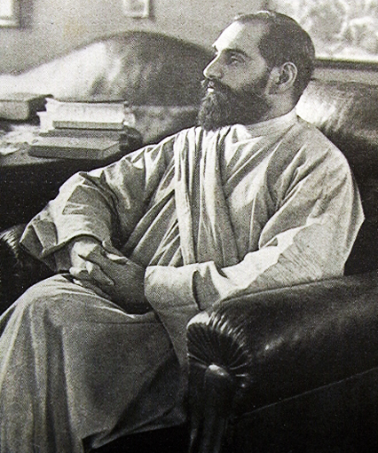

<!-- .slide: class="center" data-background-image="img/unsplash-SrlmVWkVfJM-cross.jpg" -->

# Boast of My Weakness
## II Corinthians 11:18-30
[boast-of-weakness.seanho.com](http://boast-of-weakness.seanho.com/)
 
<small>
([PDF 16:9](http://boast-of-weakness.seanho.com/boast-of-weakness-16_9.pdf),
[4:3](http://boast-of-weakness.seanho.com/boast-of-weakness-4_3.pdf))
</small>

>>>
29 May 2016, ECBC English and Bridge

----------------------------------------
<!-- .slide: class="Q" data-background="white" -->

# Q: What are you   most **proud** of?
# Why?

>>>
In life, where you are right now  
Treasure, most prized, boast

----------------------------------------

## Threat of the Charlatans
* ch10:
  The Spiritual **Battleground**
* ch11a:
  Lost Your **First Love**
* ch11b:
  Paul's Boast: **Weakness** in Ministry
* ch12a:
  Paul's Boast: Spiritual Weakness:
  + My **Grace** Is Sufficient
* ch12b:
  As **Parents** for Their Own Children

>>>
ch10-12, the last major threat to the church
in 2Cor: **boastful false apostles**.

----------------------------------------
<!-- .slide: data-background-image="img/Rembrandt_Man_in_Armour.jpg" -->

## The Spiritual Battleground (2Cor10)
* Pastor Arthur, 
  "Corinth and Beyond"
* 1-6:
  We **fight** not according to flesh
* 7-11:
  Apostolic **authority** for building up
* 12-18:
  **Measured** by God's canon

>>>
+ missions focus, armor of God
+ letters weighty
  + in person unimpressive

----------------------------------------
<!-- .slide: data-background-image="img/unsplash-NaWKMlp3tVs-bible.jpg" -->

## Lost Your First Love (2Cor11a)
* Pastor Phil, 
  "What Impresses You?"
* 1-6 (You):
  corrupted away from **simple devotion**
* 7-11: (We):
  kept ourselves **unburdensome**
* 12-15: (They):
  **masquerading** as apostles

>>>
Not: personality cults / celebrities  
Back to: simple devotion to Christ

----------------------------------------
<!-- .slide: data-background-image="img/unsplash-8CwoHpZe3qE-hands.jpg" -->

## My Grace Is Sufficient (2Cor12)
* Brother Sunday (next week)
* 1-4:
  **Pride** in God's revelation
  + Visions of heaven
* 5-8:
  **Humbled** by God's hand
  + Thorn in the flesh
* 9-10:
  Power perfected in **weakness**
* 11-21:
  As **parents** for their own children

>>>
When we become puffed up,  
God humbles us to  
Teach us to rely on His grace

----------------------------------------
<!-- .slide: data-background-image="img/unsplash-SrlmVWkVfJM-cross.jpg" -->

## Boast of My Weakness (2Cor11b)

1. **Charlatans**
  (v18-21a)
2. **Credentials** 
  (v21b-22)
3. **Crises** 
  (v23-27)
4. **Concern** 
  (v28-30)

>>>
Outline for today
1. Threat is boastful false apostles
  + And Corinthians' complacency
2. Paul meets their credentials, to deflate them
  + Show Corinthians not to be impressed by credentials
3. Paul exceeds them, not in strength but weakness
  + Normal Christian life is full of hardship and suffering
4. Burden not only physical, also spiritual + emotional
  + Paul's concern as a father to his children

----------------------------------------

## 2 Corinthians 11:18-21a (NIV)

Since many are **boasting** in the way the world does,  
**I too** will boast.

You gladly **put up** with fools since you are so **wise**!  

[You: Corinthians]

In fact, you even put up with anyone 

who **enslaves** you  
or **exploits** you or **takes advantage** of you  
or puts on **airs** or **slaps** you in the face.  

[They: Charlatans]

To my shame I admit that we were too **weak** for that!  

[We: Christ's servants]

>>>
They, You, We

----------------------------------------

## 1a. They: Charlatans (20)

* "**Enslaves**"
  + e.g., to legalism, 
  [Gal4:9](https://mobile.biblegateway.com/passage/?search=Gal4.9)
* "**Exploits**" *(eat, swallow)*
  + c.f. 
  [Mk12:40](https://mobile.biblegateway.com/passage/?search=Mk12.40)
* "**Takes advantage**" *(take)*
  + c.f. 
  [2Cor12:16](https://mobile.biblegateway.com/passage/?search=2Cor12.16)
* "**Puts on airs**" *(raise up)*
  + c.f. 
  [2Cor10:5](https://mobile.biblegateway.com/passage/?search=2Cor10.5)
* "**Slaps in face**" *(strike)*

>>>

1. to legalism, human authority
2. consume resources/money (cf widows)
3. capture in net, trick
4. elevates self
5. deride, insult, humiliate

----------------------------------------

## 1b. You: Corinthians (19)

* "You are so **wise**!"
  + pride in own judgment
* "**Put up** with fools"
  + failure to restrain
* "**Gladly**": with pleasure, delight

>>>
1. Proud of own judgment
2. Endure, accept: inaction
  + Jam4:16-17, boast in arrogance; not do right
3. Delight
  + Doctrinal liberality as virtue
  + Everyone has a voice
* (img: Buddha, 1st c. AD, Tokyo National Museum)

----------------------------------------

## 1c. We: Christ's servants (18, 21a)

* "To my **shame**" (irony!)
* "We were too **weak**"
  + c.f. v23-28
* "Boasting [as] the **world**"
  + according to **flesh**
* "**I too** will boast"
  + but not in the same way
  + boasts of **weakness**!

>>>
1. Dishonour: Corinthians ashamed of Paul
2. Content of boast
3. Corinthians were **impressed** by the boasting
* Not **stooping** to their level, but
  + **Deflating** their claims
  + Bring Corinthians back to **simple devotion**

----------------------------------------

## 1. Charlatans (18-21a)

Since many are **boasting** in the way the world does,  
**I too** will boast.

You gladly **put up** with fools since you are so **wise**!  
[You: Corinthians]

In fact, you even put up with anyone 

who **enslaves** you  
or **exploits** you or **takes advantage** of you  
or puts on **airs** or **slaps** you in the face.  
[They: Charlatans]

To my shame I admit that we were too **weak** for that!  
[We: Christ's servants]

>>>
Review pt1:
+ They proudly **abuse** you
+ You **endure** it and even delight in your liberality
+ We **deflate** the illusion
  + boast in our **weakness**
+ personality cult: drawn to powerful people
  + Jobs
  + 1Cor1:12-13 Paul, Apollo
  + mom+son follow me
  + JMS

----------------------------------------

## Providence (JMS)

For further reading:
* [Apologetics Index](http://www.apologeticsindex.org/416-jung-myung-seok)
* [A Study of Denominations](http://www.astudyofdenominations.com/denominations/providence/)
* [JMSCult](http://jmscult.com/)

>>>
Jung Myung Seok (Joshua)
+ splinter from Unification church ("Moonies")
+ numerology: Messiah
+ "always smile": life is good, hardship is only mental
+ Love Principle: Eve fell due to sex; women redeemed via sex w/JMS
  + in jail in Korea since 2009, 3 counts rape (100s of accusations)
  + "religious injustice", "persecuted Christians"

----------------------------------------
<!-- .slide: class="Q" data-background="white" -->

# Q: Are you **passive**   when you hear   **false teachers**?

>>>
**Pride** in own achievements should be a red flag

----------------------------------------
<!-- .slide: data-background-image="img/unsplash-SrlmVWkVfJM-cross.jpg" -->

## Boast of My Weakness (2Cor11b)

1. *Charlatans* (v18-21a)
2. **Credentials** 
  (v21b-22)
3. *Crises* (v23-27)
4. *Concern* (v28-30)

>>>
Paul starts his "undertaking of boasting" (17)
by **matching**, and hence **deflating**, their credentials

----------------------------------------

## 2 Corinthians 11:21b-22 (NIV)

Whatever anyone else **dares** to boast about --  
I am speaking as a **fool** --  
**I also** dare to boast about.
<!-- .element: class="fragment-highlight-blue" -->

Are they **Hebrews**? So am I.  
Are they **Israelites**? So am I.  
Are they **Abraham’s descendants**? So am I. 
<!-- .element: class="fragment-highlight-green" -->

>>>
*dare*: bold, brash, unashamed  
Paul knows boasting is foolishness
+ 12:1 no profit
+ 11:16 deem him not a fool

----------------------------------------
<!-- .slide: data-background-image="img/Moyse-Le_grand_Sanhedrin.jpg" -->

## 2. Credentials

* Paul **matches** the charlatans' credentials:
* "Hebrews": **nationality**
  + Preserve language / culture
* "Israelites": **theocracy**
  + Preserve covenant with God
* "Abraham's descendants": **Messianic right**
  + Preserve hope of eternal inheritance

>>>
+ Deflate prestige of charlatans
  + 12:11 no less, but also nothing
+ (Jam1:9-10 poor/rich boast in high/low)

----------------------------------------
<!-- .slide: data-background-image="img/Majestic-Stallion.jpg" -->

## Philippians 3:4b-7 (NIV)

If someone else thinks they have reasons  
to put **confidence** in the flesh, I have **more**:

**circumcised** on the eighth day, of the people of **Israel**,  
of the **tribe** of Benjamin, a **Hebrew** of Hebrews;  
in regard to the **law**, a Pharisee;  
as for **zeal**, persecuting the church;  
as for **righteousness** based on the law, faultless.

But whatever were **gains** to me  
I now consider **loss** for the sake of Christ.

>>>
v8: count as rubbish (skubalon): horse poop!

----------------------------------------

## Dr. John Sung

>>>
+ b. China, Methodist family
+ Ohio for undergrad + Ph.D. chemistry, in 5yrs
+ personal revival at seminary
  + confined to asylum for half year
  + where he read Bible 40x
+ returning to China, threw diplomas overboard
  + except Ph.D., for dad's sake
+ cofounded Little Flock (Local Church) with Watchman Nee
  + with now has its own controversy

----------------------------------------
<!-- .slide: class="Q" data-background="white" -->

# Q: Do you trust
# teachers because of
# their **credentials**?

>>>
Referrals, seminary, mentor

Hard work != righteousness
Ph.D.only means persistence

----------------------------------------
<!-- .slide: data-background-image="img/unsplash-SrlmVWkVfJM-cross.jpg" -->

## Boast of My Weakness (2Cor11b)

1. *Charlatans* (v18-21a)
2. *Credentials* (v21b-22)
3. **Crises** 
  (v23-27)
4. *Concern* (v28-30)

>>>
The bulk of Paul's boast is of sufferings
experienced in serving Christ.

Not his strength to overcome,
but God's power when he was overwhelmed

----------------------------------------

## Crises 11:23 (NIV)

Are they **servants** of Christ?  
(I am out of my mind to talk like this.) I am **more**.

I have **worked** much harder,

[Toil, v27]

been in **prison** more frequently,  
been **flogged** more severely,

[Beatings, v24-25]

and been exposed to **death** again and again. 

 [Danger of Death, v26]

>>>
+ **Exceeds** the charlatans
  + **not** servants of Christ, but of Satan (11:15)
  + not about **degrees** of being a servant
+ Outline of following:
  + 24-25 Beatings
  + 26 Danger of death
  + 27 Toil

----------------------------------------
<!-- .slide: data-background-image="img/Bakhuizen-Ships_Running_Aground_in_a_Storm-WGA01131.jpg" -->

## Beatings 11:24-25 (NIV)

**Five** times I received from the Jews  
the forty **lashes** minus one.  
**Three** times I was **beaten** with rods,  
**once** I was pelted with **stones**,

**three** times I was **shipwrecked**,  
I spent a night and a day in the open **sea**,

I have been constantly on the **move**.

>>>
+ Beatings and floggings
+ "Not what Paul has **done**, but what he has **bourne** (Robertson)

----------------------------------------
<!-- .slide: data-background-image="img/unsplash-JdY-P44WBpY-stormclouds.jpg" -->

## Danger and Toil 11:26-27 (NIV)

I have been in danger from **rivers**, in danger from **bandits**,  
in danger from my fellow **Jews**, in danger from **Gentiles**;  
in danger in the **city**, in danger in the **country**,  
in danger at **sea**; and in danger from **false believers**.

I have **labored** and **toiled**  
and have often gone without **sleep**;  
I have known **hunger** and **thirst**  
and have often gone without **food**;  
I have been **cold** and **naked**. 

>>>
+ Not for **guilt-trip**, thanks, or admiration
  + Approval comes from **God** (10:18), not man
  + **Normal** Christian life
+ Not typical Chinese **whining**:
  + Not sufferings overcome by **own** strength
+ But own **frailty**, inability to overcome
  + Glory goes to **God**, not self

----------------------------------------

## I Have Decided to Follow Jesus

>>>
+ story passed through **oral** tradition, details lost
+ **Garo** tribe, Assam region, NE India (E of Bangladesh)
  + formerly **head-hunters**
+ Welsh or English **missionaries**, at great personal cost
  + first family in village to come to Christ
+ two sons + wife slain before him, then he was killed
+ put to music by **Singh**, travelling evangelist in India
  + gospel of Christ, **culture** of India
  + Yellow robe of the **sadhu** (ascetic holy man)

----------------------------------------
<!-- .slide: data-background-image="img/unsplash-b8rkmfxZjdU-kids.jpg" -->

## 1 Corinthians 1:26-29 (NIV)
God chose the **foolish** things of the world  
to shame the **wise**;  
God chose the **weak** things of the world  
to shame the strong.

God chose the **lowly** things of this world  
and the **despised** things --  
and the things that are **not** --  
to nullify the things that **are**,

that **no one** may boast before him.

----------------------------------------
<!-- .slide: data-background-image="img/unsplash-b8rkmfxZjdU-kids.jpg" -->

## 1 Corinthians 1:30-31 (NIV)
It is because of him that you are in **Christ Jesus**,  
who has become for us **wisdom** from God --  
that is, our **righteousness**, **holiness** and **redemption**.

Therefore, as it is written:  
“Let the one who boasts **boast in the Lord**.”

>>>
+ if we are strong, there's no **room** left
  for God's work

----------------------------------------
<!-- .slide: class="Q" data-background="white" -->

# Q: Do you draw others   to Christ through   your **success**,   or your **frailty**?

----------------------------------------
<!-- .slide: data-background-image="img/unsplash-SrlmVWkVfJM-cross.jpg" -->

## Boast of My Weakness (2Cor11b)

1. *Charlatans* (v18-21a)
2. *Credentials* (v21b-22)
3. *Crises* (v23-27)
4. **Concern** 
  (v28-30)

----------------------------------------

## 2 Corinthians 11:28-30 (NIV)

Besides everything else,  
I face daily the pressure of my **concern** for all the churches.

Who is **weak**, and I do not feel **weak**?  
Who is led into **sin**, and I do not inwardly **burn**?

If I must boast,  
I will boast of the things that show my **weakness**.

>>>
+ weak: 1Cor12:25-26 parts of body
+ sin (stumble, offense):
  + Mk14:27, Ro9:32-33 offense at Christ
+ burn: consumed w/emotion
  + (1Cor7:9 w/passion)

----------------------------------------
<!-- .slide: data-background-image="img/unsplash-FKBg2JNYFFc-kid-rain.jpg" -->

Who is led into **sin**,  
and I do not inwardly **burn**?

>>>
kid throwing tantrums, deliberate destruction
+ can force him to be disciplined
  + but can't force him to repent
+ feel powerless, indignant
  + most of all, hurt for him

----------------------------------------
<!-- .slide: data-background-image="img/unsplash-Jztmx9yqjBw-stars.jpg" -->

## 1 Corinthians 2:2-5 (NIV)
For I resolved to know **nothing** while I was with you  
except **Jesus Christ** and him **crucified**. 

I came to you in **weakness** with great **fear** and trembling. 

My message and my preaching were  
not with wise and **persuasive words**,  
but with a demonstration of the **Spirit’s power**, 

so that your faith might not rest on **human wisdom**,  
but on **God’s power**.

>>>
+ pressure to have it all, do it all
  + career, family, volunteer, church
  + when people ask, "always smile!"
+ not about revelling in sin
  + but ack we are not strong enough to fight it
+ not drawing people to ourselves but Christ

----------------------------------------
<!-- .slide: class="Q" data-background="white" -->

# Q: What are you   most **proud** of?
# Why?

>>>
Kids? Mentorship? Church ministry? "Having it all"?
+ Are you proud because of **God's** power,
  + or your **own**?
+ Paul boasted in his own **weakness**
  + what about **you**?

----------------------------------------
<!-- .slide: data-background-image="img/unsplash-6cY-FvMlmkQ-mtn-cross.jpg" -->

## 2 Corinthians 13:4 (NIV)
For [Christ] was **crucified** in weakness,  
yet he **lives** by God’s power.

Likewise, we are **weak** in him,  
yet by **God’s power** we will live with him

>>>
Even Jesus was weak!
+ But raised by God's power

----------------------------------------
<!-- .slide: data-background-image="img/unsplash-6cY-FvMlmkQ-mtn-cross.jpg" -->
>>>
+ boasting in Corinthians not foolish
  + 12:6 speak truth
  + 10:14 reach Corinthians
  + 10:8 build up not tear down
+ boast of Christ's work
  + Rom15:17-19 Christ's work
  + 1Th2:19-20 you, our crown
  + 2Co1:12-14 you are our boast
+ 2:2-5 boast only in cross: weakness
  + Gal6:14 only in cross
